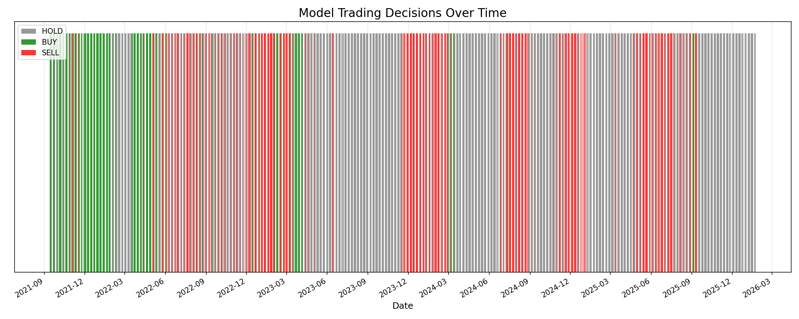

# 📊 Model Decision Streak Analysis
**Date:** 2026-01-22

## Overview
This analysis examines the stability and duration of the Prospect Theory Agent's trading decisions (Buy, Sell, Hold) over the last 5 years.

## 📈 Decision Timeline

## 🔑 Key Metrics

| Metric | Value |
| :--- | :--- |
| **Total Days Analyzed** | 1095 |
| **Total Decision Changes** | 278 |
| **Avg Days Between Changes** | **3.9 days** |

### Streak Lengths (Days)

| Action | Average Streak | Max Streak |
| :--- | :--- | :--- |
| **HOLD** | **5.4 days** | **108 days** |
| **BUY** | 3.3 days | 46 days |
| **SELL** | 2.6 days | 23 days |

## 💡 Interpretation
*   **High Frequency Changes**: The model changes its decision every ~4 days on average, indicating it is reactive to short-term market fluctuations rather than holding long-term trends.
*   **Hold Bias**: The "HOLD" action has the longest streaks, which is expected as the model often waits for clear signals.
*   **Short Sell Windows**: "SELL" signals are the most fleeting (2.6 days avg), suggesting the model treats selling as a quick tactical move rather than a long-term bearish stance.

## 📂 Files
*   `analyze_decision_streaks.py`: Script used to generate this analysis.
*   `decision_history.csv`: Full daily record of model decisions.
*   `decision_streaks.png`: Visualization of decision timeline.
