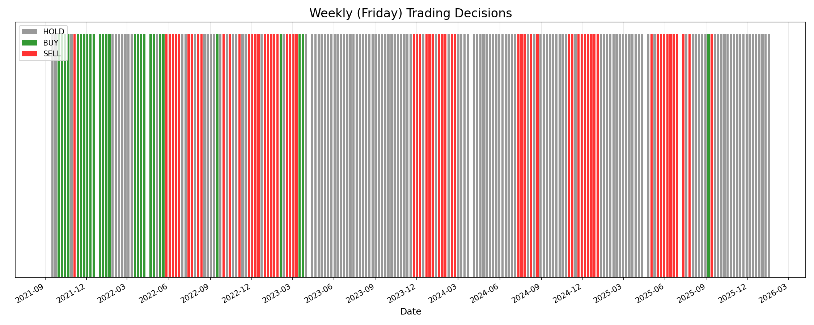

# 📅 Weekly (Friday) Decision Analysis
**Date:** 2026-01-22

## Overview
This analysis restricts the model's trading decisions to **Fridays only**. The goal was to see if filtering for the end of the week would reduce noise and potentially reveal more "Buy" signals.

## 📊 Weekly Decision Distribution
| Action | Count | Percentage |
| :--- | :--- | :--- |
| **HOLD** | 132 | **59.7%** |
| **SELL** | 62 | **28.1%** |
| **BUY** | 27 | **12.2%** |

## 📈 Weekly Timeline

## 💡 Key Findings
1.  **Still Few Buys**: Even on a weekly basis, the model is **conservative**. "Buy" signals make up only ~12% of all decisions.
2.  **Dominant Hold**: The model prefers to sit out (Hold) nearly 60% of the time.
3.  **Sell vs Buy**: The model is more than **2x more likely to Sell** than to Buy on a Friday. This suggests the model often sees the end of the week as a time to de-risk rather than enter new positions.

## 📂 Files
*   `analyze_weekly_fridays.py`: Analysis script.
*   `weekly_decision_history.csv`: Full record of Friday decisions.
*   `weekly_decision_streaks.png`: Visualization.
